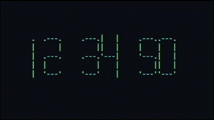

# Clockit

A beautiful terminal-based timer with ASCII art display and customizable configuration.



## Features

- Large, easy-to-read ASCII art digits
- Colorful terminal interface with customizable colors
- Countdown timer, stopwatch, and Pomodoro functionality
- Multiple time formats with overflow handling
- Configurable visual options
- Simple keyboard controls

## Quick Start

```bash
# Install
cargo install --git https://github.com/ioloej42/clockit.git

# Create config file
clockit --init-config

# Start a 5-minute timer
clockit -c 5:00

# Start a stopwatch
clockit -s

# Start a Pomodoro timer (default settings)
clockit -p

# Start a Pomodoro timer with custom settings (40min work, 10min break, 4 cycles)
clockit -p 40/10/4
```

## Installation

For detailed installation instructions, see the [Installation Guide](https://github.com/ioloej42/clockit/wiki/Installation) in the wiki.

## Usage

Clockit offers countdown timer, stopwatch, and Pomodoro functionality:

```bash
# Start a 5-minute timer
clockit -c 5:00

# Start a 90-second timer
clockit -c 1:30

# Start a 2-hour timer
clockit -c 2:00:00

# Start a stopwatch
clockit -s

# Start a Pomodoro timer (default: 25min work, 5min break)
clockit -p

# Start a custom Pomodoro timer (40min work, 10min break, 4 cycles)
clockit -p 40/10/4
```

For more examples and detailed usage, see the [Usage Guide](https://github.com/ioloej42/clockit/wiki/Usage-Guide) in the wiki.

## Configuration

Clockit can be customized through a YAML configuration file. To generate a default configuration:

```bash
clockit --init-config
```

For detailed configuration options, see the [Configuration Guide](https://github.com/ioloej42/clockit/wiki/Configuration) in the wiki.

## Documentation

For complete documentation, visit the [Clockit Wiki](https://github.com/ioloej42/clockit/wiki).

- [Installation](https://github.com/ioloej42/clockit/wiki/Installation)
- [Usage Guide](https://github.com/ioloej42/clockit/wiki/Usage-Guide)
- [Configuration](https://github.com/ioloej42/clockit/wiki/Configuration)
- [Troubleshooting](https://github.com/ioloej42/clockit/wiki/Troubleshooting)

## Contributing

Contributions are welcome! Please feel free to submit a Pull Request. See [CONTRIBUTING.md](CONTRIBUTING.md) for guidelines.

## License

This project is licensed under the MIT License - see the [LICENSE](LICENSE) file for details.